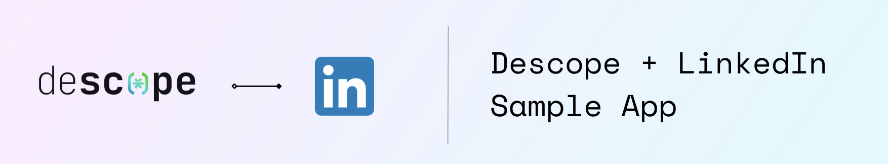

# Linkedin + Descope Next.js Sample App

This app showcases the power of using Descope to manage your provider tokens. :zap:

## Getting Started 🚀

Follow these steps to clone the repository and start using the app.

### Prerequisites

- An account on [Descope](https://descope.com/).
- A [LinkedIn Developer Application](https://www.linkedin.com/developers/apps).

### LinkedIn Provider Application Setup

You will have to connect your own LinkedIn Provider Application in Descope to manage Provider tokens. 

- First, if you do not already have one, create a LinkedIn Provider Application [here](https://www.linkedin.com/developers/apps).
- Under the Products tab on your LinkedIn Provider Application, request access to "Share on LinkedIn" and "Sign In with LinkedIn using OpenID Connect".
- Connect the application to Descope, by choosing Linkedin under the [Authentication Methods page](https://app.descope.com/settings/authentication/social) in the Descope Console. Choose "use my own account" and enter the Client ID and Client Secret found in the Auth tab on your Linkedin Provider Application. Under `scopes` add "w_member_social", and under `Advanced Settings` enable "Manage tokens from provider." 


### Clone the Repository

Start by cloning the repository to your local machine:

```bash
git clone https://github.com/descope-sample-apps/linkedin-sample-app.git
cd linkedin-sample-app
```

### Install Dependencies

Navigate to the project directory and install the necessary dependencies:

```bash
npm i
npm install @descope/nextjs-sdk
```

### Configuration

Before you run the app, make sure to configure the following:

- **Environment Variables**: Set up your environment variables in a `.env.local` file. You'll need to include your Descope project settings:

```
####### Descope ENV Variables
NEXT_PUBLIC_DESCOPE_PROJECT_ID="" // Descope Project ID
NEXT_PUBLIC_DESCOPE_FLOW_ID="" // Descope flow to use on Sign In Page. Make sure the flow includes signing in using LinkedIn OAuth.
DESCOPE_MANAGEMENT_KEY="" // Your Descope Management Key

### Running the App

Once you've configured your app, you're ready to run it:

```bash
npm run dev
```

This command starts the Next.js development server, making your app accessible at [http://localhost:3000](http://localhost:3000).

## Support :raised_hands:

If you encounter any issues or have questions, consult the Descope documentation, or reach out to our [support](https://www.descope.com/contact) for assistance.

- [Descope Documentation](https://docs.descope.com/)

## Contributing

Contributions are welcome! Please feel free to submit a pull request or open an issue if you have suggestions or improvements.

## License

This sample app is open-source and available under the MIT License. See the LICENSE file for more details.
